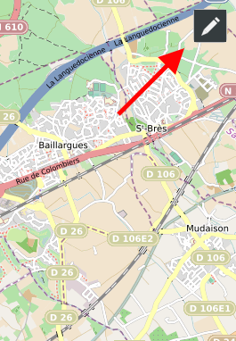
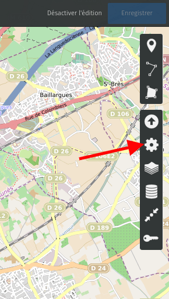
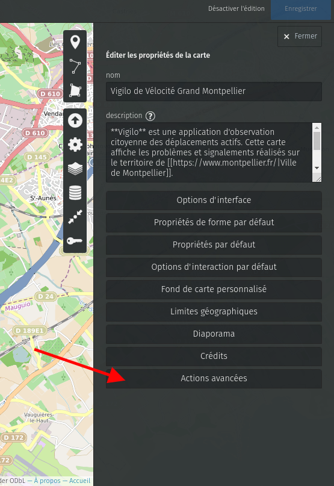
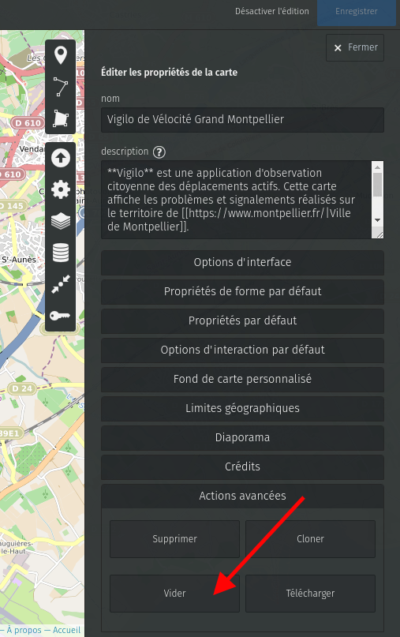
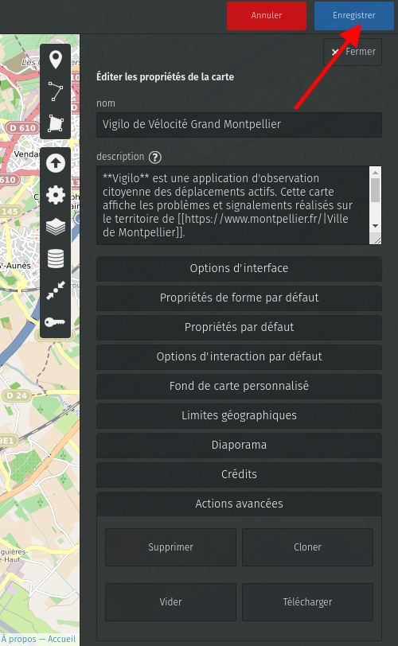
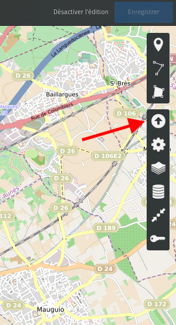
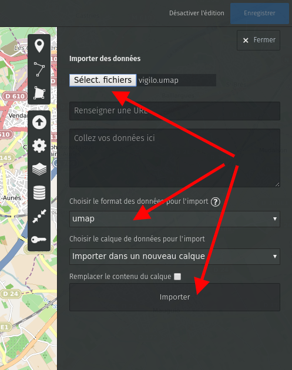

### Carte Umap

**Générer la carte**

```
git clone git@github.com:jesuisundesdeux/vigilo-backend.git
cd vigilo-backend/scripts/umap
./generate_map.sh
# Répondre aux questions
```

**Uploader la carte**

Créer une carte depuis le site [Openstreetmap Umap](https://umap.openstreetmap.fr)

Suivre les étapes suivantes
















